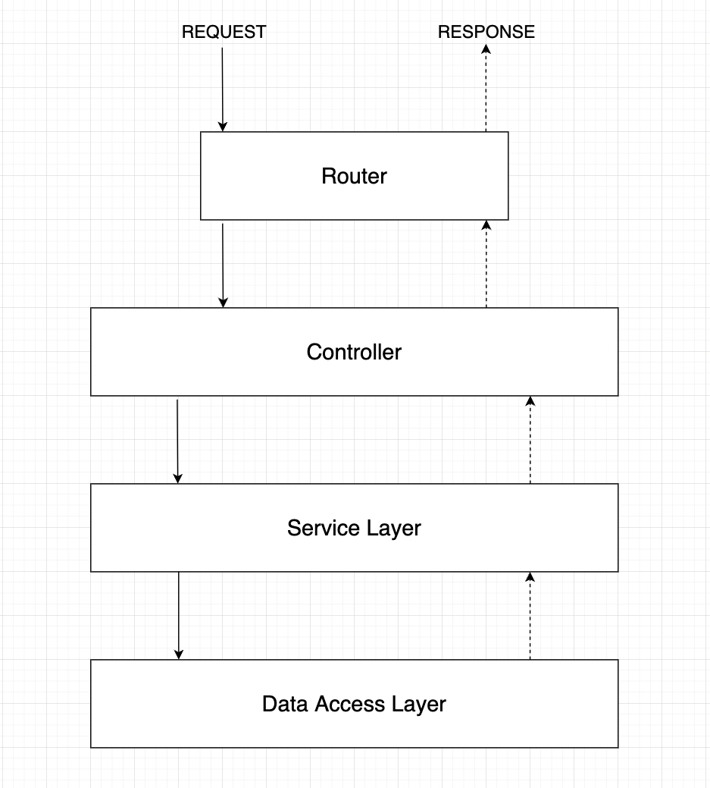

## - 3 layer architecture

- `Controller`: xử lý các request từ client, gọi các service để xử lý và trả về kết quả cho client
- `Service`: xử lý các logic nghiệp vụ
- `Data Access Layer`: xử lý các thao tác với database
---
## - Lập phiên bản cho API
- Benefits:
    - Có thể quay lại phiên bản cũ nếu có lỗi xảy ra
    - Có thể phát triển nhiều phiên bản cùng lúc
    - Có thể phát triển nhiều phiên bản khác nhau cho các client khác nhau
- Phương pháp:
```sh
    http://localhost:8080/api/v1/...
    http://localhost:8080/api/v2/...
```
---
## - Đặt tên số nhiều cho tài nguyên

